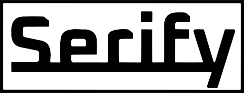
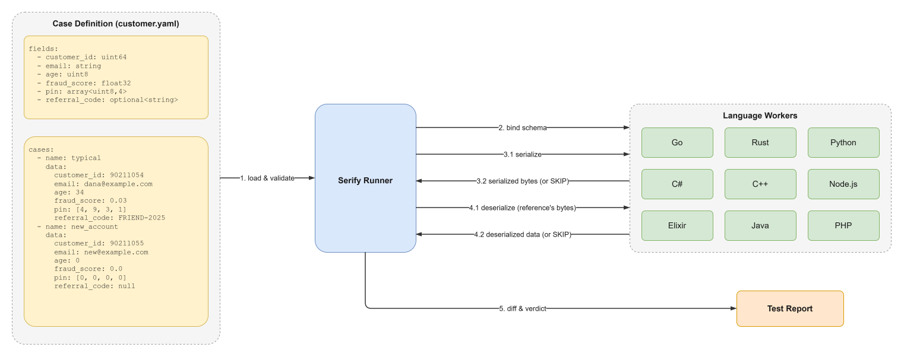

<div align="center"> 


[](https://github.com/chengxilo/serify/releases/latest)
[](LICENSE)

[](https://pkg.go.dev/github.com/chengxilo/serify/lib/go/serify)
[](https://crates.io/crates/serify)
[](https://pypi.org/project/serify/)
[](https://www.npmjs.com/package/@chengxilo/serify)
[](https://www.nuget.org/packages/Serify)
[](https://hex.pm/packages/serify)
[](https://central.sonatype.com/artifact/io.github.chengxilo/serify)
</div>

# What is Serify

Serify is a Cross-language serialization test framework. Define a schema once, verify that every language's serialization implementation produces identical bytes.

serify is a conformance harness, not a tool for writing a good serializer. It
assumes you already have one language whose tests you trust, and makes that the
reference every other language is held to. The two things it exists to spare you
are the alternatives: a golden file full of JSON or hex that no one can read, and
the same test suite reimplemented in nine languages that you then have to keep in
agreement by hand.


## Contents

- [How it works](#how-it-works)
- [Install](#install-serify-cli)
- [Quick start](#quick-start)
- [Supported languages](#supported-languages)
  - [Go](#go-writing-a-worker)
  - [Rust](#rust)
  - [Python](#python)
  - [Node / TypeScript](#node--typescript)
  - [C#](#c)
  - [C++](#c-1)
  - [Elixir](#elixir)
  - [Java](#java)
  - [PHP](#php)
- [Case definition syntax](#case-definition-syntax)
  - [Directory layout](#directory-layout)
  - [Defining a type](#defining-a-type)
  - [Field types](#field-types)
  - [Writing test data](#writing-test-data)
  - [Testing formats](#testing-formats)
  - [Reusing types with `import`](#reusing-types-with-import)
  - [Sum types: `variants:`](#sum-types-variants)
- [Audit mode](#audit-mode)
- [Model binding](#model-binding)
- [`serify validate`](#serify-validate)
- [Protocol](#protocol)
- [Local CI](#local-ci)

## How it works

1. You write `worker` for your target languages — a small program that reads an NDJSON protocol on stdin and answers serialize/deserialize requests.
2. `serify` CLI drives all workers through the same test cases and compares their outputs byte-for-byte.

<div align="center">

</div>

<sub>Diagram source: [`docs/how-it-works.drawio`](docs/how-it-works.drawio) — open it (or the SVG above, which
carries the same XML) in [draw.io](https://app.diagrams.net/) and re-export the SVG after editing.</sub>

## Install Serify CLI

```bash
go install github.com/chengxilo/serify/cmd/serify@latest
```

Or download a prebuilt binary for your platform from the
[releases page](https://github.com/chengxilo/serify/releases).

## Quick start

The example workers in this repository refer to their library by relative path
(`replace => ../../`, `path = "../../lib/rust/serify"`, `file:../../lib/node`,
…), so they build from a clone without waiting on a registry. A worker of your
own outside the repository takes the published package instead — see
[Supported languages](#supported-languages).

```bash
git clone https://github.com/chengxilo/serify && cd serify
go install ./cmd/serify

# Run the bundled suite across two workers. --cases is a directory of per-type
# case files; --ref names the worker the others are compared against, and it
# must be one of the workers you pass.
serify run --ref go --cases examples/cases examples/go examples/rust
```

To start your own worker, copy the example for your language *inside* `examples/`
so its relative path to `lib/<lang>` still resolves, then run it against a
reference worker in a **different** language:

```bash
cp -r examples/python examples/my-worker
serify run --ref go --cases examples/cases examples/go examples/my-worker
```

> Results are reported per language, so only one worker per language can run at a
> time; passing two of the same language is rejected. Compare across languages,
> which is what the harness is for.

## Supported languages

Each library is published to its language's own registry. C++ is the exception:
it is a single header, and it ships in the GitHub release rather than through a
package manager.

The example workers in this repository deliberately do **not** take the
published packages — they use a relative path into `lib/`, so a change to a
library is exercised by the conformance suite before it is released.

| Language | Example worker    | Install                                     | Published                                                                                     | How the example takes it |
|----------|-------------------|---------------------------------------------|-----------------------------------------------------------------------------------------------|--------------------------|
| Go       | `examples/go`     | `go get github.com/chengxilo/serify/lib/go/serify` | [pkg.go.dev](https://pkg.go.dev/github.com/chengxilo/serify/lib/go/serify)                | `replace` directive |
| Rust     | `examples/rust`   | `cargo add serify`                          | [crates.io/serify](https://crates.io/crates/serify)                                             | `path = "../../lib/rust/serify"` |
| Python   | `examples/python` | `pip install serify`                        | [pypi.org/serify](https://pypi.org/project/serify/)                                             | `sys.path` entry for `lib/python` |
| Node/TS  | `examples/node`   | `npm install @chengxilo/serify`             | [npmjs.com/@chengxilo/serify](https://www.npmjs.com/package/@chengxilo/serify)                   | `file:../../lib/node` |
| C#       | `examples/csharp` | `dotnet add package Serify`                 | [nuget.org/Serify](https://www.nuget.org/packages/Serify)                                       | compiled into the worker project |
| C++      | `examples/cpp`    | vendor `serify.hpp`                         | [`serify.hpp` in the release](https://github.com/chengxilo/serify/releases/latest)              | `-I lib/cpp` |
| Elixir   | `examples/elixir` | `{:serify, "~> 0.1"}`                       | [hex.pm/serify](https://hex.pm/packages/serify)                                                 | path dependency on `lib/elixir` |
| Java     | `examples/java`   | `io.github.chengxilo:serify`                | [Maven Central](https://central.sonatype.com/artifact/io.github.chengxilo/serify)               | local Maven module |
| PHP      | `examples/php`    | `composer require chengxilo/serify`         | not yet on [Packagist](https://packagist.org/)                                                  | `require_once lib/php/src/*.php` |

All ten ship from this repository under one shared version and one tag; the
current release is [`v0.1.0`](https://github.com/chengxilo/serify/releases/tag/v0.1.0).

### Go

Struct tags are the binding: field names map to schema keys by
snake_case conversion (`Username` → `username`), nested structs map
recursively, and `serify:"key"` renames a field. You supply the byte layout
as ordinary functions and register them per format:

```go
import (
    "github.com/chengxilo/serify/lib/go/serify"
)

type UserRecord struct {
    UserID   uint64 `serify:"user_id"`
    Username string
    Score    float32
}

// serialize/deserialize are your byte layout.
func serialize(u *UserRecord) ([]byte, error) {
    /* your byte layout */
    return nil, nil
}

func deserialize(u *UserRecord, data []byte) error {
    /* its inverse */
    return nil
}

func main() {
    serify.Run(serify.Suite{
        Types: map[string]serify.Type{
            "user": {
                Model: &UserRecord{},
                Formats: map[string]serify.Format{
                    "binary": {Serializer: serialize, Deserializer: deserialize},
                },
            },
        },
    })
}
```

A serializer is any `func(*T) ([]byte, error)` (and a deserializer any
`func(*T, []byte) error` or `func([]byte) (*T, error)`), so if your struct
already implements `encoding.BinaryMarshaler` / `BinaryUnmarshaler` you can pass
the method expressions directly:

```go
Formats: map[string]serify.Format{
    "binary": {
        Serializer:   (*UserRecord).MarshalBinary,
        Deserializer: (*UserRecord).UnmarshalBinary,
    },
},
```

Multiple types and multiple formats are supported:

```go
serify.Run(serify.Suite{
    Types: map[string]serify.Type{
        "user": {Model: &User{}, Formats: map[string]serify.Format{
            "binary": {Serializer: ..., Deserializer: ...},
            "json":   {Serializer: ..., Deserializer: ...},
        }},
        "order": {Model: &Order{}, Formats: map[string]serify.Format{
            "binary": {Serializer: ..., Deserializer: ...},
        }},
    },
})
```

See [`examples/go/`](examples/go/) for more detail.

### Rust

The `serify` crate derives the schema binding (`#[derive(SerifyModel)]`,
renames via `#[serify(rename = "key")]`); you supply the byte layout as
ordinary functions and register them per format:

```rust
use serify::{run_suite, Format, SerifyModel, Suite, Type};

#[derive(SerifyModel)]
struct UserRecord {
    user_id: u64,
    username: String,
    score: f32,
}

// marshal/unmarshal are your byte layout — the same job the Go
// serialize/deserialize above do.

fn main() {
    run_suite(Suite::new().with_type(
        "user",
        Type::new().with_format(
            "binary",
            Format::model::<UserRecord>()
                .serializer(UserRecord::marshal)
                .deserializer(UserRecord::unmarshal),
        ),
    ));
}
```

See [`examples/rust/`](examples/rust/) for the full worker.

### Python

`@serify_model` reads the dataclass annotations (renames via
`metadata={"serify": "key"}`) and generates the field-map conversion:

```python
from dataclasses import dataclass

from serify import Format, Type, run_suite, serify_model


@serify_model
@dataclass
class UserRecord:
    user_id: int
    username: str
    score: float

    def marshal(self) -> bytes:
        ...  # your byte layout

    @classmethod
    def unmarshal(cls, data: bytes) -> "UserRecord":
        ...  # its inverse


if __name__ == "__main__":
    run_suite({
        "user": Type(UserRecord, {
            "binary": Format(UserRecord.marshal, UserRecord.unmarshal),
        }),
    })
```

See [`examples/python/`](examples/python/) for the full worker.

### Node / TypeScript

`@Serify.Model()` plus one `@Serify.field()` per property is the binding
(renames via `@Serify.field({ rename: "key" })`):

```typescript
import { Serify, runSuite, type } from '@chengxilo/serify';

@Serify.Model()
export class UserRecord {
  @Serify.field() user_id: bigint = 0n;
  @Serify.field() username = '';
  @Serify.field() score = 0;

  marshal(): Buffer {
    /* your byte layout */
  }
  static unmarshal(data: Buffer): UserRecord {
    /* its inverse */
  }
}

runSuite({
  user: type(UserRecord, {
    binary: {
      serialize: (u: UserRecord) => u.marshal(),
      deserialize: (d: Buffer) => UserRecord.unmarshal(d),
    },
  }),
});
```

See [`examples/node/`](examples/node/) for the full worker.

### C#

`[SerifyModel]` plus one `[SerifyField]` per property is the binding (rename
by passing the key: `[SerifyField("user_id")]`):

```csharp
using System.Collections.Generic;
using Serify;

[SerifyModel]
internal sealed class UserRecord
{
    [SerifyField("user_id")] public ulong UserId { get; set; }
    [SerifyField] public string Username { get; set; } = "";
    [SerifyField] public float Score { get; set; }

    public byte[] Marshal() { /* your byte layout */ }
    public static UserRecord Unmarshal(byte[] data) { /* its inverse */ }
}

internal static class Program
{
    private static void Main()
    {
        Serify.Worker.RunSuite(new Dictionary<string, TypeEntry>
        {
            ["user"] = TypeEntry.Model<UserRecord>(new()
            {
                ["binary"] = (u => u.Marshal(), UserRecord.Unmarshal),
            }),
        });
    }
}
```

See [`examples/csharp/`](examples/csharp/) for the full worker.

### C++

`SERIFY_TO` / `SERIFY_FROM` macro blocks are the binding (renames via
`SERIFY_FIELD_RENAMED(name, kind, "key")`):

```cpp
#include "serify.hpp"

struct UserRecord {
    uint64_t user_id{};
    std::string username;
    float score{};
};

SERIFY_TO(UserRecord,
    SERIFY_FIELD(user_id, u64)
    SERIFY_FIELD(username, string)
    SERIFY_FIELD(score, f32)
)
SERIFY_FROM(UserRecord,
    SERIFY_FROM_FIELD(user_id, u64)
    SERIFY_FROM_FIELD(username, string)
    SERIFY_FROM_FIELD(score, f32)
)

// user_marshal / user_unmarshal are your byte layout — the same job the Go
// serialize/deserialize above do.

int main() {
    using namespace serify;
    SuiteMap suite;
    suite["user"]["binary"] = model_format<UserRecord>(user_marshal, user_unmarshal);
    run_suite(suite);
}
```

See [`examples/cpp/`](examples/cpp/) for the full worker.

### Elixir

`use WorkerLib.Serify.Model` plus one `serify_field` per field is the binding
(renames via `key:`):

```elixir
defmodule UserRecord do
  use WorkerLib.Serify.Model

  defstruct [:user_id, :username, :score]

  serify_field(:user_id, :u64)
  serify_field(:username, :string)
  serify_field(:score, :f32)

  # marshal/1 and unmarshal/1 are your byte layout — Elixir's bitstring syntax
  # makes one whole wire format read as a single <<...>> literal.
end

defmodule Worker do
  def main(_args) do
    WorkerLib.run_suite(%{
      "user" => %WorkerLib.Type{
        model: UserRecord,
        formats: %{"binary" => {&UserRecord.marshal/1, &UserRecord.unmarshal/1}}
      }
    })
  end
end
```

See [`examples/elixir/`](examples/elixir/) for the full worker.

### Java

`@SerifyModel` plus one `@SerifyField` per field is the binding (rename by
passing the key):

```java
import io.serify.WorkerLib;
import io.serify.WorkerLib.ModelFormatPair;
import io.serify.WorkerLib.TypeEntry;
import java.util.Map;

@WorkerLib.SerifyModel
public final class UserRecord {
    @SerifyField("user_id") public Long userId = 0L;
    @SerifyField public String username = "";
    @SerifyField public Float score = 0f;

    public byte[] marshal() { /* your byte layout */ }
    public static UserRecord unmarshal(byte[] data) { /* its inverse */ }
}

WorkerLib.runSuite(Map.of(
    "user", TypeEntry.model(UserRecord.class, Map.of(
        "binary", new ModelFormatPair<>(UserRecord::marshal, UserRecord::unmarshal)))));
```

See [`examples/java/`](examples/java/) for the full worker.

### PHP

`#[SerifyModel]` plus one `#[SerifyField]` per property is the binding (rename
by passing the key):

```php
use Serify\Attributes\SerifyField;
use Serify\Attributes\SerifyModel;
use Serify\Type;
use Serify\Worker;

#[SerifyModel]
class UserRecord
{
    #[SerifyField('user_id')] public int $userId = 0;
    #[SerifyField] public string $username = '';
    #[SerifyField] public float $score = 0.0;

    public function marshal(): string { /* your byte layout */ }
    public static function unmarshal(string $data): self { /* its inverse */ }
}

Worker::runSuite([
    'user' => new Type(UserRecord::class, [
        'binary' => [fn(UserRecord $u): string => $u->marshal(), UserRecord::unmarshal(...)],
    ]),
]);
```

See [`examples/php/`](examples/php/) for the full worker.

## Case definition syntax

Test cases live in a **directory** of YAML files. You define each data type once
(its schema), attach test cases to it, and reuse types across files with
`import`. The schema describes the *logical* shape of your data — the actual byte
layout is decided by each worker's serializer, which is exactly what serify tests.

### Directory layout

```text
cases/
  user.yaml         # type "user"
  order.yaml        # type "order"
  address.yaml      # type "address"
```

- Each non `_`-prefixed `*.yaml` defines **exactly one type**, named after the
  file: `user.yaml` → type `user`. (There is no `type:` field — the filename is
  the name, so they can never disagree. Files starting with `_` are ignored.)
- `cases` decides only whether a type is **tested** (run in the suite). Any type
  can be **imported** and reused regardless — `import` takes a file's schema and
  ignores its cases. A type with no `cases` is simply reusable-only.
- The reference language is declared by the suite, in `_config.yaml`
  (`reference_language: go`). `--ref` overrides it, and is required only for a
  suite that declares none.

### Defining a type

A type file has a `formats:` list, an optional `import:` list, a `fields:`
section (or `variants:` for a sum, see below), and a `cases:` list.

```yaml
# cases/user.yaml
formats:                  # serialization formats to test this type with
  - name: binary          # every format must name its comparison oracle:
    oracle: bytes         #   bytes    — compared byte-for-byte
  - name: json
    oracle: semantic      #   semantic — compared by decoded value
import:
  - address.yaml          # makes the `address` type available below
fields:                   # one `name: type` per line, order is preserved
  - user_id: uint64
  - username: string
  - score: float32
  - tags: list<string>
  - address: address      # a named type -> nested struct

cases:
  - name: basic
    data:
      user_id: 42
      username: "Alice"
      score: 3.14
      tags: ["admin", "user"]
      address: { street: "Main St", zip: 10001 }
```

### Field types

Each schema entry is `name: <type>`, where `<type>` is one of:

| Category   |                                         Types                               |
|------------|-----------------------------------------------------------------------------|
| Unsigned   | `uint8` `uint16` `uint32` `uint64` `uint128`                                |
| Signed     | `int8` `int16` `int32` `int64` `int128`                                     |
| Float      | `float32` `float64` (aliases `float` `double`)                              |
| Other      | `bool` (alias `boolean`) `string` `bytes`                                   |
| List       | `list<T>` — variable length                                                 |
| Array      | `array<T,N>` — fixed length `N`                                             |
| Optional   | `optional<T>` — a value or `null`                                           |
| Map        | `map<K,V>` — `K` is usually `string`                                        |
| Named type | the name of another type file (e.g. `address`) — inlined as a nested struct |

Containers nest freely: `map<string, list<uint32>>`, `optional<address>`,
`array<uint8,16>`, and so on.

### Writing test data

In `data:`, write each field's value in YAML according to its type:

| Type                       | How to write it           |             Example                                 |
|----------------------------|---------------------------|-----------------------------------------------------|
| integers (any width)       | a number (quoted decimal string also accepted) | `amount: 170141183460469231731687303715884105727` |
| `float32` / `float64`      | a number                  | `score: 3.14`                                       |
| `bool`                     | `true` / `false`          | `active: true`                                      |
| `string`                   | a string                  | `username: "Alice"`                                 |
| `bytes`                    | a byte array or hex string | `metadata: [0xde, 0xad]` or `metadata: "dead"` (empty = `[]` or `""`) |
| `list<T>` / `array<T,N>`   | a sequence                | `counts: [1, 2, 3, 4]`                              |
| `optional<T>`              | the value, or `null`      | `profile: null`                                     |
| named type / struct        | a mapping                 | `address: { street: "x", zip: 1 }`                  |
| `map<K,V>`                 | a mapping                 | `scores: { math: 95 }`                              |

Each case has a `name`, and its **global id is `type/format/case`** (e.g.
`user/binary/basic`) — the format is part of it because the same case runs once
per declared format. That id is what appears in the report and is sent to the
workers as the request `id`.

### Testing formats

Every tested type **must declare its `formats:`** explicitly (there is no
implicit default — a type with `cases:` but no `formats:` is rejected at load
time), and **every format must name its `oracle:`** — `bytes` to compare the
serialized bytes, `semantic` to compare the decoded value. That is mandatory too,
and for the same reason: it decides whether a disagreement between two workers is
a failure or is allowed wire freedom, which is not something to leave implicit.

Each worker is re-bound once per format and its cases run again under that
format, so a single run compares every language for each format. A worker that
doesn't implement a format is marked `SKIP` for it (and if the reference worker
lacks it, that whole format is skipped). Reusable-only types (no `cases:`,
imported by others) don't need `formats:`.

Note that byte-for-byte parity across languages only holds for formats with a
fully-specified wire layout — that is what `oracle: bytes` asserts. Text formats
like JSON often differ between implementations (float formatting, whitespace), and
any type holding a `map<K,V>` differs by construction, since a map is unordered
and workers do not sort it. Those want `oracle: semantic`, which compares the
decoded value instead. See `docs/protocol.md` § Comparison oracles.

### Reusing types with `import`

Any type file can be imported by path so your schema can reference it by name —
`import` takes the imported file's `fields:` (or `variants:`) section and ignores
any `cases:` it has. So you can import a tested type just as well; a type with no
`cases:` is just one that exists *only* to be reused:

```yaml
# cases/address.yaml — reusable-only (no cases)
fields:
  - street: string
  - zip: uint32
```

```yaml
# cases/order.yaml
import:
  - address.yaml
fields:
  - order_id: uint64
  - shipping: address     # resolves to address.yaml's schema, inlined
```

`import` is **transitive** (imports of imported files are followed) and
cycle-safe; a single file may import several others.

### Sum types: `variants:`

Under `variants:` each entry is `tag: payload`, a value is *exactly one* of them,
and an entry with no type is a unit variant. The section name is the whole
declaration — there is no separate flag.

```yaml
# cases/money.yaml — reusable-only, the struct payload below refers to it
fields:
  - currency: string
  - amount_minor: int64
```

```yaml
# cases/channel.yaml
import:
  - money.yaml
variants:
  - silent:              # no type -> a unit variant
  - sms: string          # a scalar payload
  - push: uint64
  - invoice: money       # a named type -> a struct payload
```

Referenced from another type, a sum **is** the field's type — there is no
wrapping struct:

```yaml
fields:
  - notification_id: uint32
  - channel: channel     # the variant sits directly at `channel`
  - urgent: bool
```

Tested on its own (a `variants:` file with its own `formats:` and `cases:`), the
sum is carried under the single key `value`, because the top level of a schema is
a list of named fields and a bare sum is not one:

```yaml
cases:
  - name: pushed
    data: { value: { push: 12345 } }
  - name: quiet
    data: { value: silent }   # a unit variant is written bare, as just the tag
```

The tag ordinal is **not** on the wire — only the name is — so each worker
chooses its own byte encoding for the tag, usually the declaration order.

Do **not** model a sum as a `kind` tag plus flat payload fields: every inactive
field then needs a default on the round-trip, and nothing stops a case from
setting a payload that does not belong to the declared tag. Use `enum<a,b,c>`
when the variants carry no data at all, and a `variants:` type as soon as one
does.

## Audit mode

Pass `--audit` to `serify run` to enable unsafe-behaviour detection inside every worker. The runner sends `"audit": true` in the bind message; each worker library then runs additional checks and reports findings as **warnings** (not failures — they appear in the report with status `WARN` and do not cause a non-zero exit).

Six unsafe behaviours are detected:

| Detection | How |
|-----------|-----|
| **Serialize mutation** | Snapshot FieldMap before serialization, compare after |
| **Serialize instability** | Call serializer twice, compare hex output |
| **Output zero-copy** | XOR-flip the returned buffer, re-extract the model, compare |
| **Deserialize zero-copy** | XOR-flip input buffer after deserialization, check which FieldMap entries change |
| **Input-buffer mutation** | Snapshot buffer before deserialization, compare after |
| **Deserialize instability** | Re-deserialize from a fresh clone of the input, diff FieldMaps |

All 9 worker libraries (Go, Rust, Python, Node, C#, C++, Java, Elixir, PHP) implement these. Output zero-copy is the one exception: it only applies where the language's memory model lets a model field mutably alias the output buffer, so C++, Elixir and PHP omit it (their strings/binaries cannot alias).

## Model binding

Each library provides an idiomatic way to map native structs/classes to FieldMap, avoiding manual `set_*`/`get_*` calls:

| Language | Mechanism | Key features |
|----------|-----------|-------------|
| **Go** | Struct tags | `serify:"field_name"` on struct fields; reflection-based `reflectFill`/`reflectExtract` |
| **Rust** | Derive macro | `#[derive(SerifyModel)]` + `#[serify(rename = "key")]`; compile-time codegen |
| **Python** | Decorator | `@serify_model` on `@dataclass`; field names → schema keys; `metadata={"serify": "key"}` for renames |
| **Node/TS** | Decorator | `@Serify.Model()` class + `@Serify.field({rename: "key"})` property decorators |
| **C#** | Attribute | `[SerifyModel]` class + `[SerifyField("key")]` property attributes |
| **C++** | Macro | `SERIFY_TO(Type, ...)` / `SERIFY_FROM(Type, ...)` blocks with `SERIFY_FIELD(name, kind)` |
| **Java** | Annotation | `@SerifyModel` class + `@SerifyField("key")` field annotations |
| **Elixir** | `use` macro | `use WorkerLib.Serify.Model` + `serify_field :name, :type, key: "key"` |
| **PHP** | Attributes | `#[SerifyModel]` class + `#[SerifyField('key')]` property attributes |

### Python — `@serify_model`

```python
from dataclasses import dataclass, field
from serify import serify_model

@serify_model
@dataclass
class User:
    user_id: int
    name: str
    email: str = field(default="", metadata={"serify": "email_addr"})
```

Generates `to_field_map()` and `from_field_map(fm)` class methods.

### `sum` fields

A `sum` binds onto whatever sum type the language already has, so six of the
nine need **nothing declared** — the binding reads the arms off the type itself:
a Rust `enum`, a Java `sealed interface`, a Python union of dataclasses, a PHP
property union type, a C# `abstract record` hierarchy, an Elixir tagged tuple.
The three that cannot be introspected name their arms instead: C++
`SERIFY_SUM(T, "a", "b")` (no reflection), Node `@Serify.sum([A, B])` (union
types are erased at runtime), Go a `serify.Converter` (implementations of an
interface cannot be enumerated).

All nine share one arity rule: **0 fields → unit variant, 1 field → that value is
the payload, N fields → the payload is a struct**; tags are the arm's type name
in snake_case. See `examples/*/notification.*` for a worked example per language.

### Rust — `#[derive(SerifyModel)]`

```rust
#[derive(SerifyModel)]
#[serify(rename_all = "snake_case")]
struct User {
    user_id: u64,
    name: String,
    #[serify(rename = "email_addr")]
    email: String,
}
```

Generates `to_field_map(&self)` and `from_field_map(fm: &FieldMap) -> Result<Self>`.

## `serify validate`

```bash
serify validate                        # validate ./cases
serify validate --cases examples/cases # validate a named directory
serify validate --cases examples/cases examples/go   # also detect a worker
```

Checks the case files for structural validity (schema consistency, cross-references, format declarations) without running workers. Useful as a pre-commit check.

Positional arguments are **worker directories**, exactly as in `serify run`; the case directory is named with `--cases`. Passing a case directory positionally is rejected with a message pointing at the flag.

## Protocol

The NDJSON wire protocol is documented in [`docs/protocol.md`](docs/protocol.md).

## Local CI

```bash
# Run the full CI pipeline locally (requires Docker)
act

# Run a single job
act -j test-go
act -j conformance --matrix language:rust
```

## Acknowledgments

- Got this idea from [Apache Iggy](https://github.com/apache/iggy)
- Implementation inspired by [Protobuf Conformance Tests](https://github.com/protocolbuffers/protobuf/blob/main/conformance/README.md)
- And thanks to whoever read this far!
