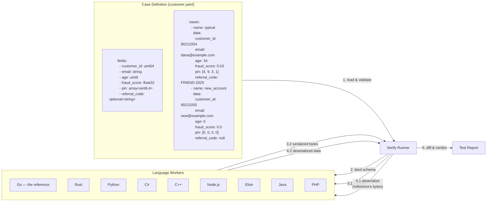

# Serify Basic Example

```mermaid
flowchart LR
    subgraph CASES["Case Definition (customer.yaml)"]
        direction TB
        C1["<div align='left'>
        fields:
        &nbsp;&nbsp;- customer_id: uint64
        &nbsp;&nbsp;- email: string
        &nbsp;&nbsp;- age: uint8
        &nbsp;&nbsp;- fraud_score: float32
        &nbsp;&nbsp;- pin: array&lt;uint8,4&gt;
        &nbsp;&nbsp;- referral_code: optional&lt;string&gt;
        </div>"]
        C2["<div align='left'>
        cases:
        &nbsp;&nbsp;- name: typical
        &nbsp;&nbsp;&nbsp;&nbsp;data:
        &nbsp;&nbsp;&nbsp;&nbsp;&nbsp;&nbsp;customer_id: 90211054
        &nbsp;&nbsp;&nbsp;&nbsp;&nbsp;&nbsp;email: dana@example.com
        &nbsp;&nbsp;&nbsp;&nbsp;&nbsp;&nbsp;age: 34
        &nbsp;&nbsp;&nbsp;&nbsp;&nbsp;&nbsp;fraud_score: 0.03
        &nbsp;&nbsp;&nbsp;&nbsp;&nbsp;&nbsp;pin: [4, 9, 3, 1]
        &nbsp;&nbsp;&nbsp;&nbsp;&nbsp;&nbsp;referral_code: FRIEND-2025
        &nbsp;&nbsp;- name: new_account
        &nbsp;&nbsp;&nbsp;&nbsp;data:
        &nbsp;&nbsp;&nbsp;&nbsp;&nbsp;&nbsp;customer_id: 90211055
        &nbsp;&nbsp;&nbsp;&nbsp;&nbsp;&nbsp;email: new@example.com
        &nbsp;&nbsp;&nbsp;&nbsp;&nbsp;&nbsp;age: 0
        &nbsp;&nbsp;&nbsp;&nbsp;&nbsp;&nbsp;fraud_score: 0.0
        &nbsp;&nbsp;&nbsp;&nbsp;&nbsp;&nbsp;pin: [0, 0, 0, 0]
        &nbsp;&nbsp;&nbsp;&nbsp;&nbsp;&nbsp;referral_code: null
        </div>"]
    end

    subgraph WORKERS["Language Workers"]
        direction TD
        W1["Go — the reference"]
        W2["Rust"]
        W3["Python"]
        W4["C#"]
        W5["C++"]
        W6["Node.js"]
        W7["Elixir"]
        W8["Java"]
        W9["PHP"]
    end

    REPORT["Test Report"]

    CASES -->|"1. load &amp; validate"| RUNNER["Serify Runner"]

    RUNNER -->|"2. bind schema"| WORKERS

    RUNNER -->|"3.1 serialize"| WORKERS
    WORKERS -->|"3.2 serialized bytes"| RUNNER

    RUNNER -->|"4.1 deserialize<br/>(reference's bytes)"| WORKERS
    WORKERS -->|"4.2 deserialized data"| RUNNER

    RUNNER -->|"5. diff &amp; verdict"| REPORT
```
