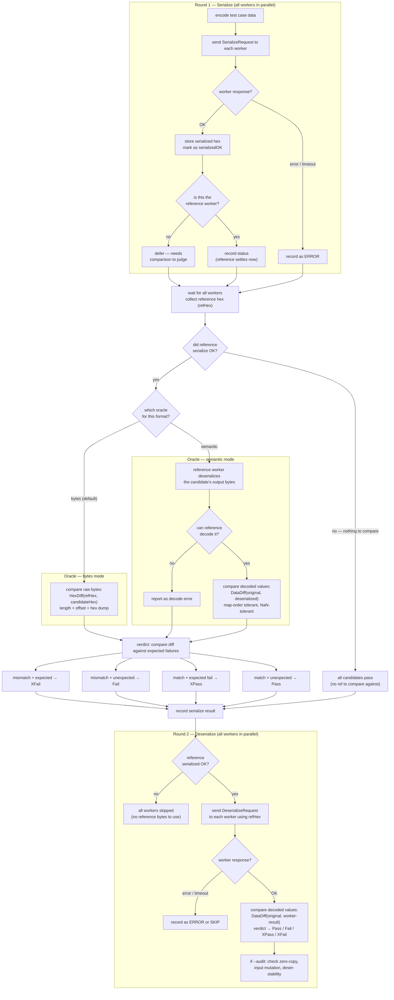

# Orchestrate Flow

```mermaid
flowchart TD
    subgraph R1["Round 1 — Serialize (all workers in parallel)"]
        direction TB
        A["encode test case data"] --> B["send SerializeRequest to each worker"]
        B --> C{"worker response?"}
        C -->|"error / timeout"| D["record as ERROR"]
        C -->|"OK"| E["store serialized hex<br/>mark as serializedOK"]
        E --> F{"is this the<br/>reference worker?"}
        F -->|"yes"| G["record status<br/>(reference settles now)"]
        F -->|"no"| H["defer — needs<br/>comparison to judge"]
    end

    H --> I["wait for all workers<br/>collect reference hex (refHex)"]
    G --> I
    D --> I

    I --> J{"did reference<br/>serialize OK?"}
    J -->|"no — nothing to compare"| L["all candidates pass<br/>(no ref to compare against)"]

    J -->|"yes"| M{"which oracle<br/>for this format?"}

    subgraph BYTES["Oracle — bytes mode"]
        N1["compare raw bytes:<br/>HexDiff(refHex, candidateHex)<br/>length + offset + hex dump"]
    end

    subgraph SEMANTIC["Oracle — semantic mode"]
        S1["reference worker deserializes<br/>the candidate's output bytes"]
        S1 --> S2{"can reference<br/>decode it?"}
        S2 -->|"no"| S3["report as decode error"]
        S2 -->|"yes"| S4["compare decoded values:<br/>DataDiff(original, deserialized)<br/>map-order tolerant, NaN-tolerant"]
    end

    M -->|"bytes (default)"| N1
    M -->|semantic| S1

    N1 --> V
    S3 --> V
    S4 --> V

    V["verdict: compare diff against expected failures"]
    V --> V1["mismatch + expected → XFail"]
    V --> V2["mismatch + unexpected → Fail"]
    V --> V3["match + expected fail → XPass"]
    V --> V4["match + unexpected → Pass"]

    V1 --> R["record serialize result"]
    V2 --> R
    V3 --> R
    V4 --> R
    L --> R

    R --> R2

    subgraph R2S["Round 2 — Deserialize (all workers in parallel)"]
        direction TB
        R2{"reference<br/>serialized OK?"}
        R2 -->|"no"| R2s["all workers skipped<br/>(no reference bytes to use)"]
        R2 -->|"yes"| R2d["send DeserializeRequest<br/>to each worker using refHex"]
        R2d --> R2r{"worker response?"}
        R2r -->|"error / timeout"| R2e["record as ERROR or SKIP"]
        R2r -->|"OK"| R2dd["compare decoded values:<br/>DataDiff(original, worker-result)<br/>verdict → Pass / Fail / XPass / XFail"]
        R2dd --> R2audit["if --audit: check zero-copy,<br/>input mutation, deser-stability"]
    end
```
